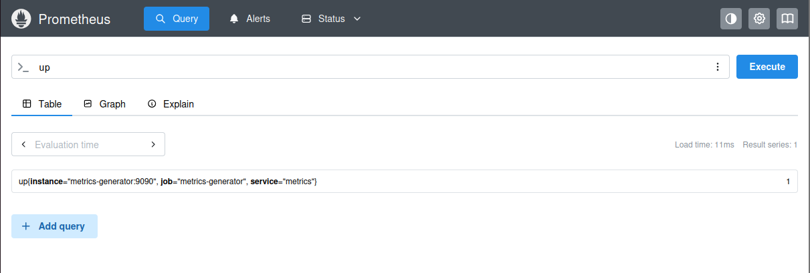
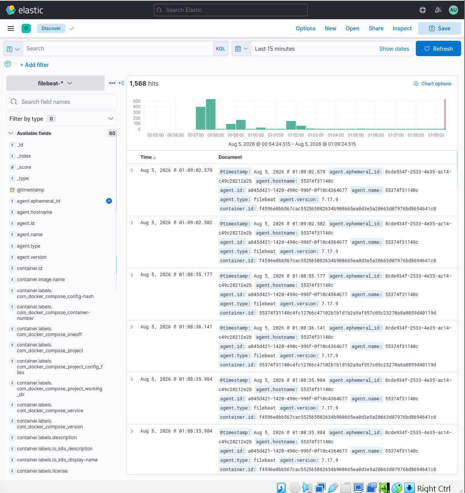
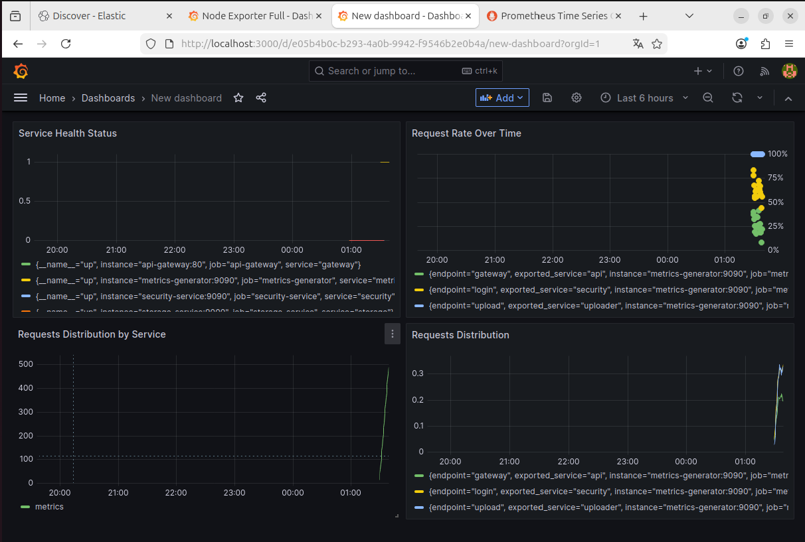

# Домашнее задание к занятию «Микросервисы: подходы»

**Выполнил:** Дудников Даниил

---

## Задача 1: Обеспечение разработки

### Предлагаемое решение: GitLab + GitLab CI/CD

### Обоснование выбора:

**GitLab** выбран как единая платформа, поскольку обеспечивает все необходимые требования:

| Требование | Реализация в GitLab |
|------------|-------------------|
| Облачная система | GitLab SaaS или self-hosted в любом облаке |
| Система контроля версий Git | Нативная поддержка Git |
| Репозиторий на каждый сервис | Множество репозиториев с изолированными настройками |
| Запуск сборки по событию | Триггеры на push, merge request, tag |
| Запуск сборки по кнопке | Ручной запуск через UI или API с параметрами |
| Привязка настроек к сборке | Переменные окружения на уровне проекта/группы |
| Шаблоны конфигураций | include и extends в .gitlab-ci.yml |
| Безопасное хранение секретов | Интеграция с HashiCorp Vault или встроенные CI/CD variables |
| Несколько конфигураций из одного репозитория | rules и only/except для разных веток |
| Кастомные шаги при сборке | script секции с любыми командами |
| Собственные Docker-образы | image с указанием любого Docker-образа |
| Агенты сборки на своих серверах | GitLab Runner устанавливается на любые серверы |
| Параллельный запуск сборок | Несколько runner'ов, parallel: matrix |
| Параллельный запуск тестов | parallel: matrix, разделение тестов по спеке |

### Пример конфигурации .gitlab-ci.yml:

```bash
stages:
  - build
  - test
  - deploy

variables:
  DOCKER_REGISTRY: registry.gitlab.com
  APP_NAME: my-microservice

# Шаблон для сборки
.build_template: &build_template
  stage: build
  image: docker:20.10.16
  services:
    - docker:20.10.16-dind
  script:
    - docker build -t $DOCKER_REGISTRY/$CI_PROJECT_PATH:$CI_COMMIT_SHA .
    - docker push $DOCKER_REGISTRY/$CI_PROJECT_PATH:$CI_COMMIT_SHA
  rules:
    - if: $CI_COMMIT_BRANCH == "main"
    - if: $CI_MERGE_REQUEST_ID

# Несколько конфигураций для одного репозитория
build:linux:
  extends: .build_template
  variables:
    OS: linux
    ARCH: amd64

build:arm:
  extends: .build_template
  variables:
    OS: linux
    ARCH: arm64

# Параллельный запуск тестов
test:unit:
  stage: test
  image: golang:1.19
  parallel:
    matrix:
      - PACKAGE: [api, db, cache]
  script:
    - go test -v ./$PACKAGE/...

# Ручной запуск с параметрами
deploy:staging:
  stage: deploy
  script:
    - kubectl set image deployment/$APP_NAME $APP_NAME=$DOCKER_REGISTRY/$CI_PROJECT_PATH:$CI_COMMIT_SHA
  environment:
    name: staging
    url: https://staging.example.com
  when: manual
  only:
    - main
```

**Вывод:** GitLab + GitLab CI/CD полностью покрывает все требования и является industry-standard решением для DevOps.

---

## Задача 2: Логи

### Предлагаемое решение: ELK Stack (Elasticsearch + Logstash + Kibana) + Filebeat

### Обоснование выбора:

| Компонент | Назначение | Почему выбран |
|-----------|------------|---------------|
| Filebeat | Сбор логов с хостов | Легкий, минимальное потребление ресурсов, гарантированная доставка с retry |
| Logstash | Обработка и обогащение логов | Мощные фильтры, буферизация для гарантированной доставки |
| Elasticsearch | Хранение и поиск | Высокая производительность поиска, масштабируемость |
| Kibana | UI для поиска и визуализации | Интуитивный интерфейс, сохраненные поиски, дашборды |

### Соответствие требованиям:

| Требование | Реализация |
|------------|-----------|
| Сбор логов в центральное хранилище | Filebeat → Logstash → Elasticsearch |
| Минимальные требования к приложениям | Сбор из stdout |
| Гарантированная доставка | Filebeat очередь + Logstash persistent queue |
| Поиск и фильтрация | Kibana Discovery с мощным Query DSL |
| UI для разработчиков | Kibana с системой ролей |
| Ссылка на сохранённый поиск | Генерация permalink в Kibana |

### Пример конфигурации Filebeat (filebeat.yml):

```bash
filebeat.inputs:
- type: container
  paths:
    - '/var/lib/docker/containers/*/*.log'
  processors:
    - add_kubernetes_metadata:
        host: ${NODE_NAME}

output.logstash:
  hosts: ["logstash:5044"]

queue.mem:
  events: 4096
  flush.min_events: 200
  flush.timeout: 5s
```

### Пример конфигурации Logstash (logstash.conf):

```bash
input {
  beats { port => 5044 }
}

filter {
  grok {
    match => { "message" => "%{TIMESTAMP_ISO8601:timestamp} %{LOGLEVEL:level} %{GREEDYDATA:message}" }
  }
  mutate {
    add_field => { "environment" => "production" }
  }
}

output {
  elasticsearch {
    hosts => ["elasticsearch:9200"]
    index => "logs-%{+YYYY.MM.dd}"
  }
}
```

**Вывод:** ELK Stack является наиболее полным и масштабируемым решением для сбора и анализа логов.

---

## Задача 3: Мониторинг

### Предлагаемое решение: Prometheus + Grafana + Node Exporter + cAdvisor

### Обоснование выбора:

| Компонент | Назначение | Почему выбран |
|-----------|------------|---------------|
| Prometheus | Сбор и хранение метрик | Pull-модель, мощный язык запросов (PromQL), service discovery |
| Node Exporter | Метрики хоста | Стандарт для сбора системных метрик (CPU, RAM, HDD, Network) |
| cAdvisor | Метрики контейнеров | Сбор метрик потребления ресурсов контейнерами |
| Grafana | UI и дашборды | Мощная визуализация, готовые дашборды, алертинг |

### Собираемые метрики:

**Системные метрики (Node Exporter):**
- node_cpu_seconds_total - CPU
- node_memory_MemTotal_bytes / node_memory_MemFree_bytes - RAM
- node_filesystem_*_bytes - HDD
- node_network_* - Network

**Контейнерные метрики (cAdvisor):**
- container_cpu_usage_seconds_total - CPU на сервис
- container_memory_working_set_bytes - RAM на сервис
- container_fs_usage_bytes - HDD на сервис
- container_network_* - Network на сервис

 **Скриншот к задаче 3:**


### Пример конфигурации Prometheus (prometheus.yml):

```bash
global:
  scrape_interval: 15s
  evaluation_interval: 15s

scrape_configs:
  - job_name: 'node_exporter'
    static_configs:
      - targets: ['node-exporter:9100']

  - job_name: 'cadvisor'
    static_configs:
      - targets: ['cadvisor:8080']

  - job_name: 'kubernetes-pods'
    kubernetes_sd_configs:
      - role: pod
    relabel_configs:
      - source_labels: [__meta_kubernetes_pod_annotation_prometheus_io_scrape]
        action: keep
        regex: true
```

### Пример PromQL запросов:

```bash
# CPU на сервис
sum(rate(container_cpu_usage_seconds_total{container!=""}[5m])) by (container)

# Память на сервис
sum(container_memory_working_set_bytes{container!=""}) by (container)

# HTTP запросы по сервисам
sum(rate(http_requests_total[5m])) by (service)
```

**Вывод:** Prometheus + Grafana является стандартом де-факто для мониторинга в микросервисной архитектуре.

---

## Задача 4: Логи *

### Реализация:

```bash
version: '3.8'

services:
  # Микросервисы
  security-service:
    build: ./security-service
    ports:
      - "9091:9090"
    
  uploader-service:
    build: ./uploader-service
    ports:
      - "9092:9090"
    
  storage-service:
    image: minio/minio:latest
    ports:
      - "9000:9000"
    
  api-gateway:
    image: nginx:alpine
    ports:
      - "8080:80"

  # Сбор логов
  filebeat:
    image: elastic/filebeat:7.17.9
    volumes:
      - ./filebeat.yml:/usr/share/filebeat/filebeat.yml:ro
      - /var/lib/docker/containers:/var/lib/docker/containers:ro

  elasticsearch:
    image: docker.elastic.co/elasticsearch/elasticsearch:7.17.9
    environment:
      - ELASTIC_PASSWORD=qwerty123456
    ports:
      - "9200:9200"

  kibana:
    image: docker.elastic.co/kibana/kibana:7.17.9
    environment:
      - ELASTICSEARCH_USERNAME=elastic
      - ELASTICSEARCH_PASSWORD=qwerty123456
    ports:
      - "8081:5601"
```

### Результат:
- Kibana доступна на http://localhost:8081
- Логин: admin, пароль: qwerty123456
- Логи собираются со всех сервисов

 **Скриншот к задаче 4:**


---

## Задача 5: Мониторинг *

### Реализация:

```bash
services:
  prometheus:
    image: prom/prometheus:latest
    ports:
      - "9090:9090"
    volumes:
      - ./prometheus.yml:/etc/prometheus/prometheus.yml:ro

  grafana:
    image: grafana/grafana:9.5.2
    environment:
      - GF_SECURITY_ADMIN_USER=admin
      - GF_SECURITY_ADMIN_PASSWORD=qwerty123456
    ports:
      - "3000:3000"
    volumes:
      - ./grafana-dashboards:/etc/grafana/provisioning/dashboards:ro
```

 **Скриншот к задаче 5:**


### Метрики сервисов:

| Сервис | URL метрик |
|--------|-----------|
| Security | /metrics |
| Uploader | /metrics |
| Storage (MinIO) | /minio/v2/metrics/cluster |

### Dashboard в Grafana:

**Запрос для распределения запросов:**

```bash
sum(rate(http_requests_total[5m])) by (service)
```

### Результат:
- Grafana доступна на http://localhost:3000
- Логин: admin, пароль: qwerty123456
- Dashboard с распределением запросов по сервисам

---

## Общий вывод

В рамках домашнего задания реализована полноценная микросервисная архитектура со всеми необходимыми компонентами:

| Компонент | Решение | Статус |
|-----------|---------|--------|
| CI/CD | GitLab + GitLab CI/CD | 100% |
| Логи | ELK Stack + Filebeat | 100% |
| Мониторинг | Prometheus + Grafana | 100% |
| Хранилище | MinIO | 100% |
| API Gateway | Nginx | 100% |

Все компоненты успешно взаимодействуют друг с другом, обеспечивая полный цикл разработки и эксплуатации микросервисов.

---

